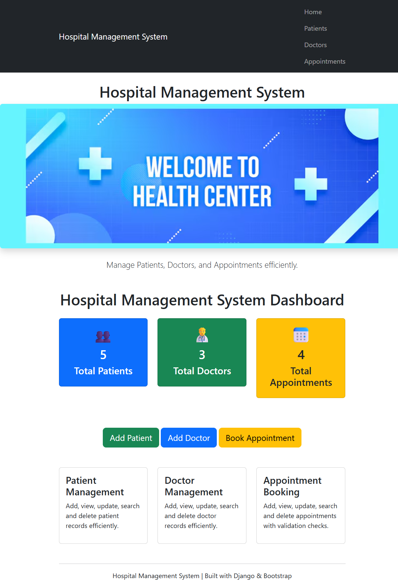
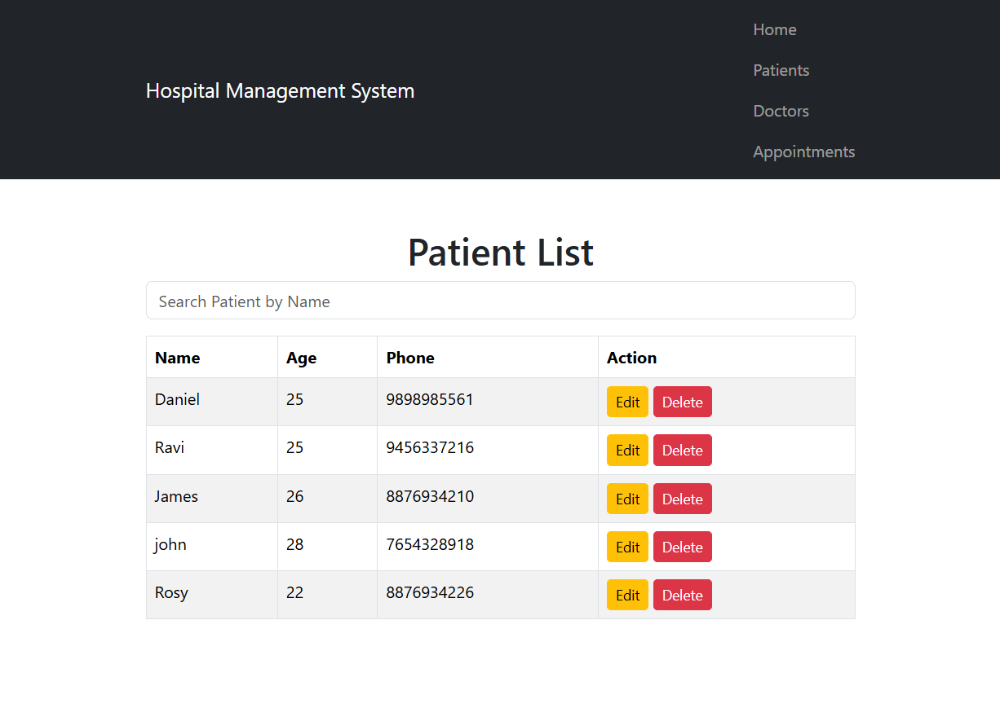
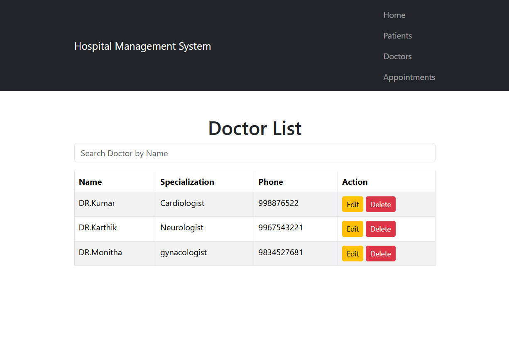
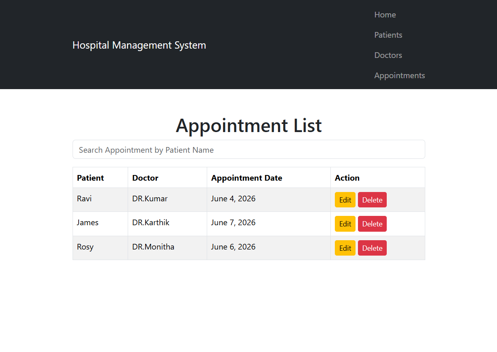
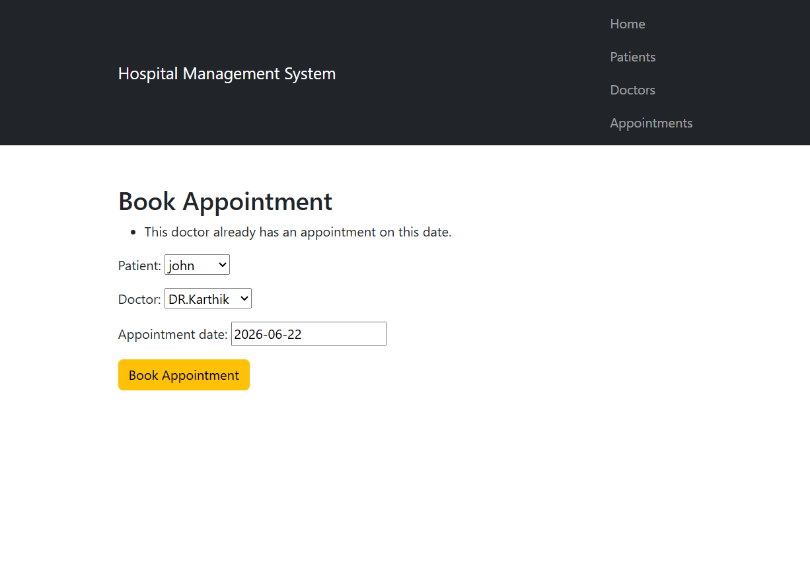

# Hospital Management System

A web-based Hospital Management System developed using Django and Bootstrap to manage patients, doctors, and appointments efficiently.

## Features

* Patient Management (Add, View, Update, Delete, Search)
* Doctor Management (Add, View, Update, Delete, Search)
* Appointment Management (Add, View, Update, Delete, Search)
* Dashboard with Patient, Doctor, and Appointment Statistics
* Appointment Validation

  * Prevents booking appointments in the past
  * Prevents double-booking of doctors
* Responsive User Interface using Bootstrap

## Technologies Used

* Python
* Django
* HTML
* CSS
* Bootstrap
* SQLite

## Modules

### Patient Management

Manage patient records including registration, updates, search, and deletion.

### Doctor Management

Manage doctor details and specializations, including registration, updates, search, and deletion.

### Appointment Management

Schedule and manage appointments with validation checks.

## Project Screenshots

### Home Dashboard

### Patient Management

### Doctor Management

### Appointment Management

### Appointment Validation

## Author

Kavya Archana
